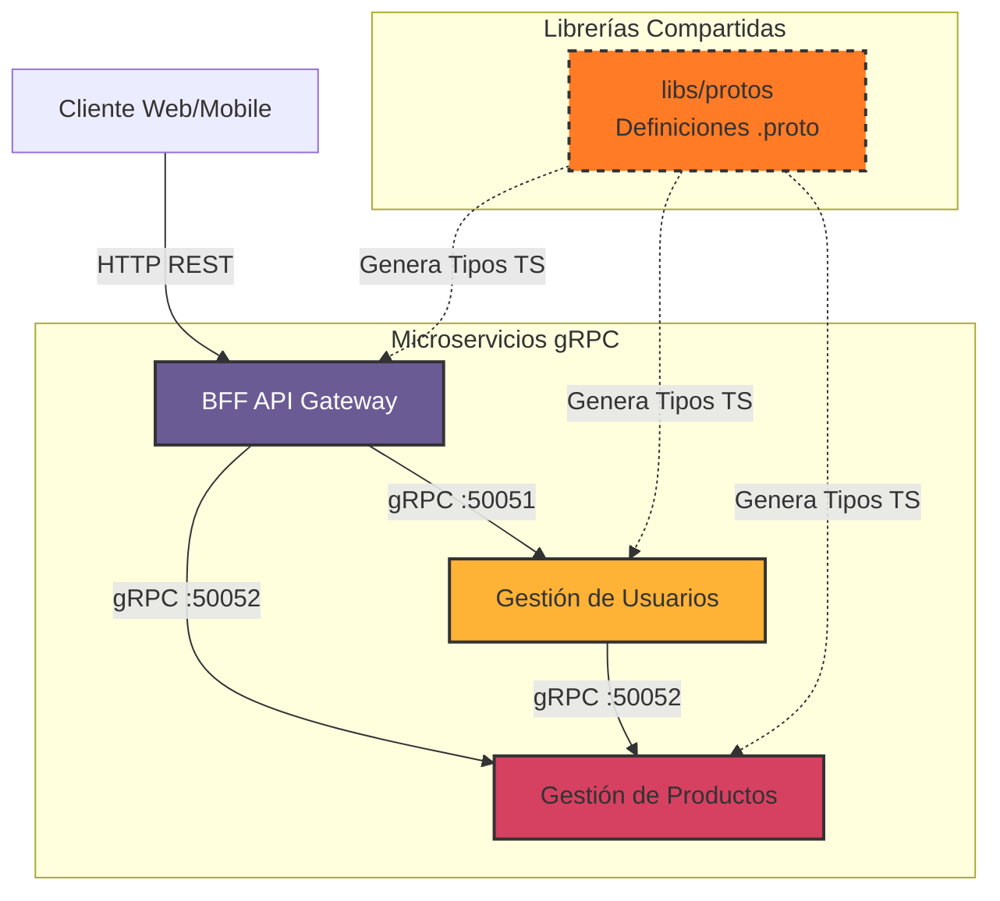
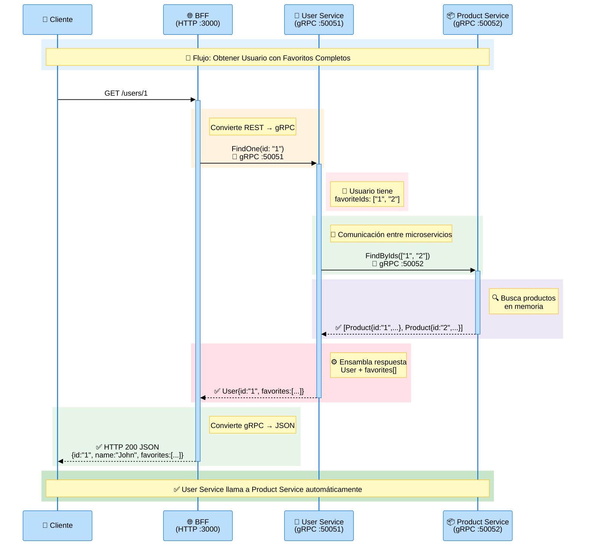

# gRPC Monorepo con NestJS y Nx

Este proyecto es una implementación de referencia para una arquitectura de microservicios dentro de un monorepo gestionado por [Nx](https://nx.dev). Demuestra una comunicación eficiente entre servicios utilizando **gRPC** y expone una API unificada a través de un patrón **BFF (Backend For Frontend)**.

## 📋 Descripción General

El sistema está compuesto por tres aplicaciones principales: un API Gateway (BFF) y dos microservicios de dominio (Usuarios y Productos). La comunicación interna se realiza estrictamente mediante gRPC, asegurando tipos fuertes y alto rendimiento, mientras que el BFF expone endpoints REST tradicionales para el consumo de clientes externos.

### Características Principales

- **Monorepo Nx**: Gestión eficiente de múltiples proyectos y librerías compartidas.
- **NestJS**: Framework progresivo de Node.js utilizado en todos los servicios.
- **gRPC**: Protocolo de comunicación de alto rendimiento para interconexión de microservicios.
- **Protobuf**: Definición de contratos de API centralizada en una librería compartida.
- **Tipado Fuerte**: Generación automática de interfaces TypeScript a partir de archivos `.proto`.
- **Comunicación Inter-Microservicios**: Los microservicios se comunican entre sí vía gRPC (ej: User Service → Product Service).

## 🏗 Arquitectura

El siguiente diagrama ilustra el flujo de comunicación y la dependencia de los componentes:



### Flujo de Productos Favoritos

El sistema implementa una relación entre usuarios y productos donde:

1. **User Service** almacena solo los IDs de productos favoritos (`favoriteIds: string[]`)
2. Cuando se consulta un usuario, **User Service** llama a **Product Service** vía gRPC para obtener los datos completos
3. El cliente recibe el usuario con los productos favoritos completos



## 📂 Estructura del Proyecto

- **apps/**
  - **bff**: Servidor HTTP que actúa como orquestador. Recibe peticiones REST y llama a los microservicios correspondientes.
  - **user**: Servicio encargado del dominio de **Usuarios**. Implementa la definición `user.proto`. Se comunica con Product Service para obtener datos de productos favoritos.
  - **product**: Servicio encargado del dominio de **Productos**. Implementa la definición `product.proto`.

- **libs/**
  - **protos**: Librería central que contiene los archivos de definición `.proto` y scripts para generar el código TypeScript (stubs) necesario para clientes y servidores.
    - `src/proto/user.proto`: Definiciones para el servicio de usuarios (incluye gestión de favoritos).
    - `src/proto/product.proto`: Definiciones para el servicio de productos.

## 🚀 Comandos Principales

### Instalación

```bash
npm install
```

### Generación de Código gRPC

Si modificas los archivos `.proto`, necesitas regenerar los tipos TypeScript:

```bash
npx nx run protos:generate-protos
```

O directamente:

```bash
cd libs/protos
node generate-protos.cjs
```

### Ejecutar Servicios

Puedes ejecutar todos los servicios en paralelo (útil para desarrollo):

```bash
npx nx run-many --target=serve --all
```

O iniciar cada uno individualmente en terminales separadas:

```bash
# Iniciar BFF (http://localhost:3000)
npx nx serve bff

# Iniciar Microservicio de Usuarios (0.0.0.0:50051)
npx nx serve user

# Iniciar Microservicio de Productos (0.0.0.0:50052)
npx nx serve product
```

### Build

```bash
# Build de todos los proyectos
npx nx run-many --target=build --all

# Build individual
npx nx build user
npx nx build product
npx nx build bff
```

## 🧪 Endpoints de Prueba

Una vez que el sistema esté corriendo, puedes probar la comunicación a través del BFF:

### Usuarios

- **Listar usuarios**
  ```bash
  curl http://localhost:3000/users
  ```

- **Obtener usuario por ID** (incluye productos favoritos completos)
  ```bash
  curl http://localhost:3000/users/1
  ```
  
  Respuesta:
  ```json
  {
    "id": "1",
    "name": "John Doe",
    "email": "john@example.com",
    "age": 30,
    "createdAt": "2025-12-11T20:00:00.000Z",
    "favorites": [
      {
        "id": "1",
        "name": "Laptop",
        "description": "High performance laptop",
        "price": 1500,
        "stock": 50,
        "createdAt": "2025-12-11T20:00:00.000Z"
      }
    ]
  }
  ```

- **Agregar producto a favoritos**
  ```bash
  curl -X POST http://localhost:3000/users/1/favorites \
    -H "Content-Type: application/json" \
    -d '{"productId": "2"}'
  ```

- **Remover producto de favoritos**
  ```bash
  curl -X DELETE http://localhost:3000/users/1/favorites/2
  ```

### Productos

- **Listar productos**
  ```bash
  curl http://localhost:3000/products
  ```

- **Obtener producto por ID**
  ```bash
  curl http://localhost:3000/products/1
  ```

## 🎯 Características Implementadas

### ✅ Productos Favoritos

Los usuarios pueden tener una lista de productos favoritos. La implementación sigue las mejores prácticas de microservicios:

- **Separación de datos**: User Service solo almacena IDs de productos
- **Comunicación gRPC**: User Service consulta Product Service para obtener datos completos
- **API REST**: El BFF expone endpoints REST para gestionar favoritos
- **Tipado fuerte**: Todos los contratos están definidos en `.proto` files

Ver documentación detallada en [FAVORITES_FEATURE.md](./FAVORITES_FEATURE.md)

## 📖 Documentación Adicional

- [FAVORITES_FEATURE.md](./FAVORITES_FEATURE.md) - Documentación detallada de la funcionalidad de favoritos

## 🛠 Tecnologías Utilizadas

- **Nx**: Monorepo tooling
- **NestJS**: Framework backend
- **gRPC**: Comunicación entre microservicios
- **Protocol Buffers**: Definición de contratos
- **TypeScript**: Lenguaje de programación
- **ts-proto**: Generador de tipos TypeScript desde .proto

## 📝 Notas de Desarrollo

### Regenerar Protos

Cada vez que modifiques un archivo `.proto`, debes regenerar los tipos:

```bash
cd libs/protos
node generate-protos.cjs
```

### Puertos

- **BFF**: 3000 (HTTP)
- **User Service**: 50051 (gRPC)
- **Product Service**: 50052 (gRPC)

### Datos de Prueba

El sistema incluye datos de prueba en memoria:

**Usuarios:**
- ID: `1` - John Doe (favoritos: productos 1 y 2)
- ID: `2` - Jane Doe (favoritos: producto 2)

**Productos:**
- ID: `1` - Laptop ($1500)
- ID: `2` - Mouse ($50)


