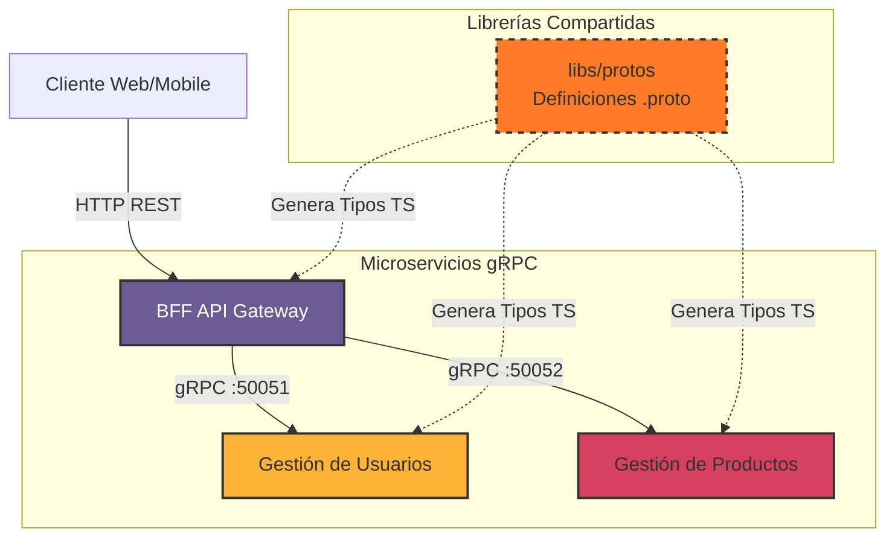

# gRPC Monorepo con NestJS y Nx

Este proyecto es una implementación de referencia para una arquitectura de microservicios dentro de un monorepo gestionado por [Nx](https://nx.dev). Demuestra una comunicación eficiente entre servicios utilizando **gRPC** y expone una API unificada a través de un patrón **BFF (Backend For Frontend)**.

## 📋 Descripción General

El sistema está compuesto por tres aplicaciones principales: un API Gateway (BFF) y dos microservicios de dominio (Usuarios y Productos). La comunicación interna se realiza estrictamente mediante gRPC, asegurando tipos fuertes y alto rendimiento, mientras que el BFF expone endpoints REST tradicionales para el consumo de clientes externos.

### Características Principales

- **Monorepo Nx**: Gestión eficiente de múltiples proyectos y librerías compartidas.
- **NestJS**: Framework progresivo de Node.js utilizado en todos los servicios.
- **gRPC**: Protocolo de comunicación de alto rendimiento para interconexión de microservicios.
- **Protobuf**: Definición de contratos de API centralizada en una librería compartida.
- **Tipado Fuerte**: Generación automática de interfaces TypeScript a partir de archivos `.proto`.

## 🏗 Arquitectura

El siguiente diagrama ilustra el flujo de comunicación y la dependencia de los componentes:



## 📂 Estructura del Proyecto

- **apps/**
  - **bff**: Servidor HTTP que actúa como orquestador. Recibe peticiones REST y llama a los microservicios correspondientes.
  - **user**: Servicio encargado del dominio de **Usuarios**. Implementa la definición `user.proto`.
  - **product**: Servicio encargado del dominio de **Productos**. Implementa la definición `product.proto`.

- **libs/**
  - **protos**: Librería central que contiene los archivos de definición `.proto` y scripts para generar el código TypeScript (stubs) necesario para clientes y servidores.
    - `src/proto/user.proto`: Definiciones para el servicio de usuarios.
    - `src/proto/product.proto`: Definiciones para el servicio de productos.

## 🚀 Comandos Principales

### Instalación

```bash
npm install
```

### Generación de Código gRPC

Si modificas los archivos `.proto`, necesitas regenerar los tipos TypeScript:

```bash
npx nx run protos:generate-protos
```

### Ejecutar Servicios

Puedes ejecutar todos los servicios en paralelo (útil para desarrollo):

```bash
npx nx run-many --target=serve --all
```

O iniciar cada uno individualmente en terminales separadas:

```bash
# Iniciar BFF (http://localhost:3000)
npx nx serve bff

# Iniciar Microservicio de Usuarios (0.0.0.0:50051)
npx nx serve user

# Iniciar Microservicio de Productos (0.0.0.0:50052)
npx nx serve product
```

## 🧪 Endpoints de Prueba

Una vez que el sistema esté corriendo, puedes probar la comunicación a través del BFF:

- **Usuarios**:
  - `GET http://localhost:3000/api/users` - Lista usuarios (BFF -> User Service).
  - `GET http://localhost:3000/api/users/:id` - Obtiene un usuario por ID.

- **Productos**:
  - `GET http://localhost:3000/api/products` - Lista productos (BFF -> Product Service).
  - `GET http://localhost:3000/api/products/:id` - Obtiene un producto por ID.
